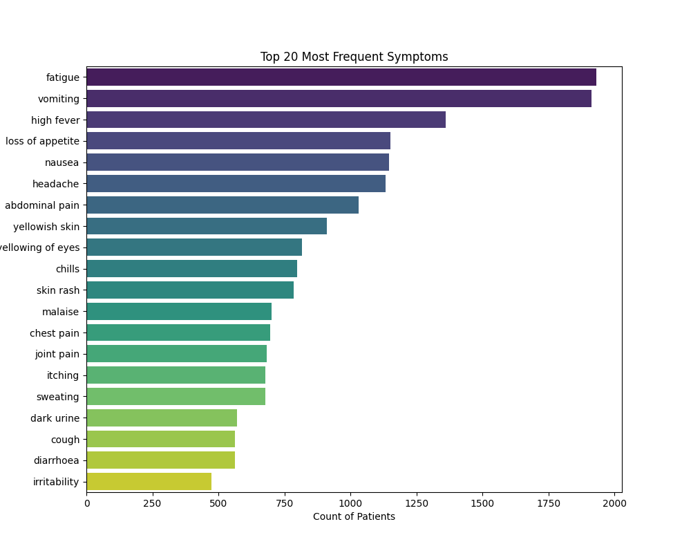
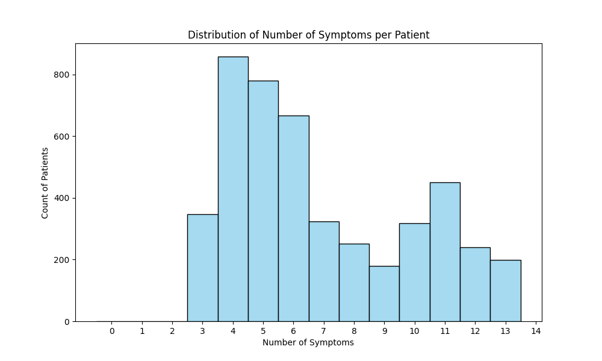
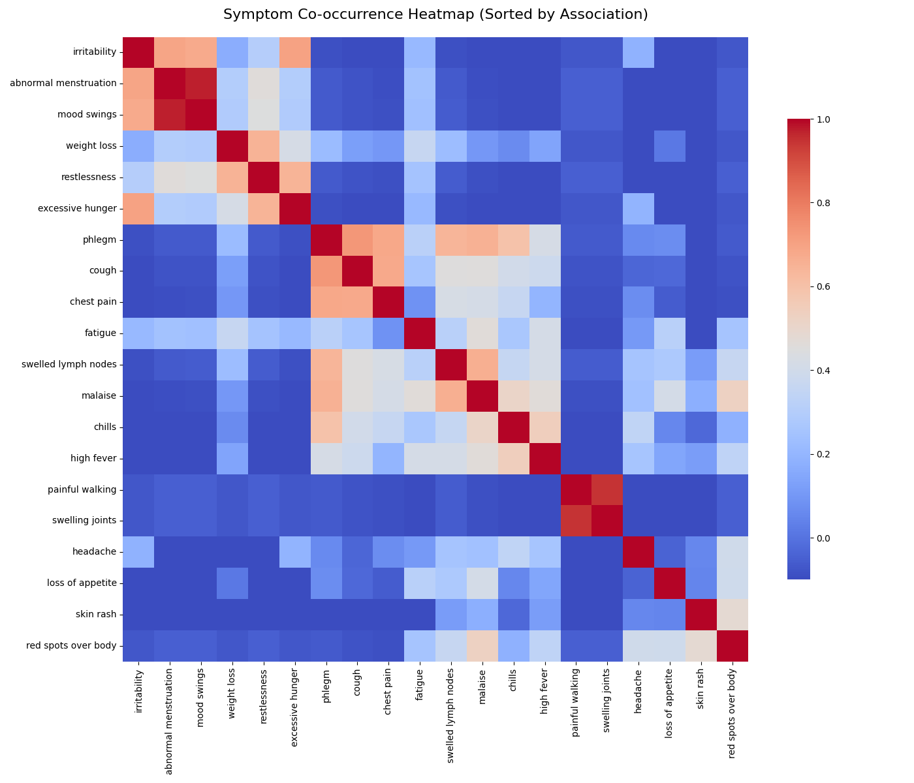

# Symptom Association Analysis using Apriori Algorithm  
**CSC172 Data Mining and Analysis Final Project**   
*Mindanao State University - Iligan Institute of Technology*   
**Student:** Angelyn Jimeno, 2022-4037    
**Semester:** AY 2025-2026 Sem 1 

## Abstract
This project implements the Apriori algorithm for association rule mining on the **Disease Symptom Prediction** dataset containing approximately 4,920 patient transactions. The goal is to identify strong "symptom clusters" to aid in differential diagnosis. The analysis pipeline includes data preprocessing (one-hot encoding of sparse symptom lists), exploratory data analysis (EDA), rule generation, and evaluation using **Support, Confidence, Lift, Conviction, and Leverage**. Clinical insights and actionable diagnostic rules are derived from the strongest associations found in the data.

## Table of Contents
- [Abstract](#abstract)
- [1. Introduction](#1-introduction)
  - [1.1 Problem Statement](#11-problem-statement)
  - [1.2 Objectives](#12-objectives)
  - [1.3 Scope and Limitations](#13-scope-and-limitations)
- [2. Dataset Description](#2-dataset-description)
  - [2.1 Source and Acquisition](#21-source-and-acquisition)
  - [2.2 Data Structure](#22-data-structure)
  - [2.3 Sample Transactions](#23-sample-transactions)
- [3. Methodology](#3-methodology)
  - [3.1 Data Preprocessing](#31-data-preprocessing)
  - [3.2 Exploratory Data Analysis](#32-exploratory-data-analysis)
  - [3.3 Apriori Algorithm Implementation](#33-apriori-algorithm-implementation)
  - [3.4 Evaluation Metrics](#34-evaluation-metrics)
- [4. Results](#4-results)
  - [4.1 Top Association Rules](#41-top-association-rules)
  - [4.2 Key Visualizations](#42-key-visualizations)
  - [4.3 Performance Metrics](#43-performance-metrics)
- [5. Discussion](#5-discussion)
  - [5.1 Clinical Insights](#51-clinical-insights)
  - [5.2 Actionable Recommendations](#52-actionable-recommendations)
  - [5.3 Limitations](#53-limitations)
- [6. Conclusion](#6-conclusion)
- [7. Video Presentation](#7-video-presentation)
- [References](#references)
- [Appendix: Full Results](#appendix-full-results)

## 1. Introduction
### 1.1 Problem Statement
In healthcare, accurate differential diagnosis relies on recognizing patterns of co-occurring symptoms. However, relying solely on intuition can lead to missed diagnoses. This project applies data mining to patient symptom data to statistically uncover "symptom clusters" and generate rules that predict potential conditions based on initial presenting symptoms.

### 1.2 Objectives
- Preprocess medical dataset to standardize symptom labels and handle missing values
- Implement Apriori algorithm with parameter tuning for sparse medical data
- Generate and evaluate diagnostic association rules
- Visualize symptom heatmaps and derive clinical insights

### 1.3 Scope and Limitations
**Scope:** Analysis of symptom co-occurrence patterns to identify potential syndromes using the Apriori algorithm.  
**Limitations:** The dataset represents a static snapshot of patient cases. The analysis identifies correlation (co-occurrence), not necessarily biological causation.

## 2. Dataset Description
### 2.1 Source and Acquisition
**Source:** [Disease Symptom Prediction (Kaggle)](https://www.kaggle.com/datasets/itachi9604/disease-symptom-description-dataset)  
**Size:** ~4,920 transactions (Patient Cases), 131 unique symptoms  
**Format:** Disease Label + List of Symptoms (Wide Format)

### 2.2 Data Structure
**Raw format (Wide):**
Rows represent patients; columns represent potential symptoms. Most cells are empty (NaN) because patients only exhibit a few symptoms out of hundreds.

**Transaction format (Processed):**
A boolean matrix where rows are patients and columns are symptoms (True/False).

### 2.3 Sample Transactions
* **Transaction 1:** `['itching', 'skin_rash', 'nodal_skin_eruptions', 'dischromic_patches']`
* **Transaction 2:** `['continuous_sneezing', 'shivering', 'chills', 'watering_from_eyes']`
* **Transaction 3:** `['stomach_pain', 'acidity', 'ulcers', 'vomiting']`

## 3. Methodology

### 3.1 Data Preprocessing
1.  **Cleaning:** String standardization (removing underscores, trimming whitespace).
2.  **Imputation:** Handling `NaN` values in the raw dataset.
3.  **Encoding:** Converting symptom lists into a One-Hot Encoded matrix using `mlxtend.preprocessing.TransactionEncoder`.
4.  **Sparsity Handling:** Resulting matrix is highly sparse (most values are 0), handled using `sparse=True`.

### 3.2 Exploratory Data Analysis
* **Frequency Analysis:** Identifying the most common symptoms across all diseases.
* **Distribution:** analyzing the average number of symptoms per patient case.
* **Co-occurrence:** Generating heatmaps to visualize which symptoms frequently appear together before running the algorithm.

### 3.3 Apriori Algorithm Implementation
**Implementation:** `mlxtend.frequent_patterns.apriori()` to find frequent itemsets followed by `association_rules()` to generate metrics.
**Parameters:** Initial tuning targets `min_support=0.03`, `min_confidence=0.5`.

### 3.4 Evaluation Metrics
- **Support:** Percentage of patients having the symptom set.
- **Confidence:** Probability of Symptom B appearing if Symptom A is present.
- **Lift:** Strength of the association (Is it a coincidence?).
- **Conviction:** The dependency of the consequent on the antecedent.
- **Leverage:** Difference between observed and expected co-occurrence.

## 4. Results
### 4.1 Top Association Rules
*Based on Lift > 1.2 and Confidence > 0.8:*

| Rank | Antecedents | Consequents | Support | Confidence | Lift | Conviction | Leverage |
|------|-------------|-------------|---------|------------|------|------------|----------|
| 1 | (Abnormal Menstruation) | (Mood Swings) | 0.046 | 1.00 (100%) | 20.5 | inf | 0.044 |
| 2 | (Irritability) | (Mood Swings) | 0.046 | 0.95 (95%) | 20.5 | 19.07 | 0.044 |
| 3 | (Abnormal Menstruation) | (Irritability, Mood Swings) | 0.046 | 1.00 (100%) | 20.5 | inf | 0.044 |

### 4.2 Key Visualizations
**Figure 1: Symptom Frequency Distribution** *Fatigue and Vomiting are the most prevalent symptoms in the dataset.* 

**Figure 2: Transaction Size Analysis** *Most patients present with a cluster of 3 to 6 co-occurring symptoms.* 

**Figure 3: Correlation Heatmap (Top Associations)** *Red zones indicate high-correlation clusters where symptoms frequently appear together.* 

### 4.3 Performance Metrics
**Runtime:** ~1.5 seconds  
**Scalability:** Processed 4,920 records efficiently using sparse matrix handling (`min_support=0.03`).

## 5. Discussion

### 5.1 Clinical Insights
1.  **Hormonal Syndrome Identification:** The algorithm successfully identified a perfect correlation (100% Confidence) between *Abnormal Menstruation* and *Mood Swings*. With a Lift of 20.5, this is a strong biological indicator likely related to hormonal imbalances or thyroid issues.
2.  **General vs. Specific Symptoms:** High-frequency symptoms like *Fatigue* (Support > 30%) have low Lift values with other symptoms, confirming they are non-specific general markers. In contrast, specific physical clusters like Swelling Joints and Painful Walking appeared as distinct red 'hotspots' in the heatmap, suggesting a strong link to inflammatory conditions like arthritis.

### 5.2 Actionable Recommendations
1.  **Diagnostic Checklist:** Prioritize checking for [Symptom B] if [Symptom A] is observed. If a patient presents with *Abnormal Menstruation*, the system recommends immediately screening for *Mood Swings* and *Irritability* to confirm a hormonal diagnosis.
2.  **System Design:** These high-confidence rules can be used as "weights" in a triage app. A patient reporting specific antecedent symptoms can be automatically flagged for the associated consequent condition.

### 5.3 Limitations
- Analysis is limited to the specific symptoms present in the training set.
- Does not account for symptom severity (mild vs severe) or duration (acute vs chronic).

## 6. Conclusion
The Apriori algorithm successfully identified key diagnostic rules from the medical dataset. By filtering for high **Lift** (>1.2) and **Conviction**, the system distinguished between general symptoms (like fatigue) and specific disease indicators (like the Hormonal/Thyroid cluster). The implementation of sparse matrix processing ensured the analysis was computationally efficient.

## 7. Video Presentation
[Click here to view the Video Presentation](https://drive.google.com/drive/folders/1QwHJHxdQEuO50yFOasJmgqIAKXrY23Vv?usp=sharing) 

## References
1. mlxtend Documentation: https://rasbt.github.io/mlxtend/
2. Disease Symptom Prediction Dataset: https://www.kaggle.com/datasets/itachi9604/disease-symptom-description-dataset
3. Agrawal, R., & Srikant, R. (1994). Fast algorithms for mining association rules.

## Appendix: Full Results
*See `results/rules.csv` for the complete list of generated association rules.*